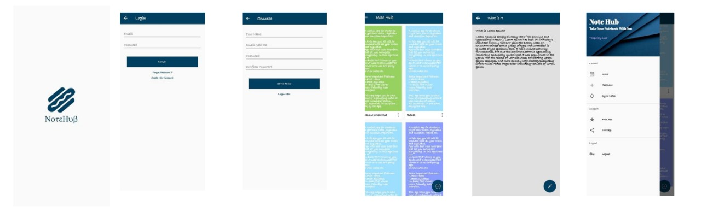

  

<h1 align="center">
  NoteHub
</h1>

 

## What is NOTEHUB?
* An app📲📲📲 that lets you save your notes,details,inspirations,thoughts at a place.

# How to📲 Download NoteHub?

* Visit 👀 https://play.google.com/store/apps/details?id=com.notehub.notehub

# ScreenShots💕

  

# How to Use ✔📲 NoteHub?

* Step-1: Visit👀 https://play.google.com/store/apps/details?id=com.notehub.notehub
* Step-2: Download the App ✔
* Step-3: Now write your content.
* Step-4: Save them,edit them as per your requirements.
* Step-5: No more to remember now.This will act as your memory!!🏍🧒🧒

# Request from Notehub😅😅😅
* Rate our app on  google Play store ⭐⭐⭐⭐⭐
* Comment and tell us about your experience 📱
* NoteHub will help you 24X7😎😎

# ThankYou ❤

<h1 align="center">
   © NoteHub 2020
</h1>

